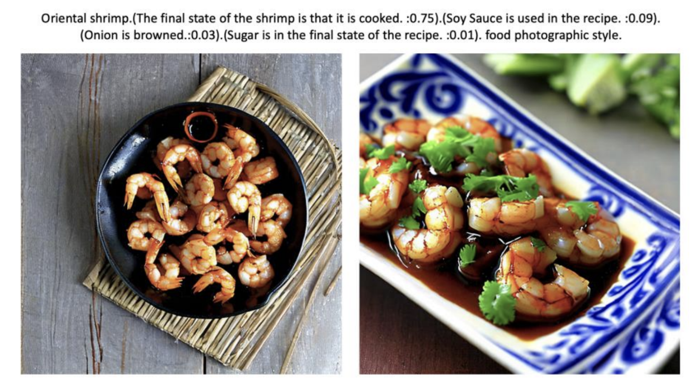

# GenAI for Recipe-to-Image Creation at Scale

<p align="left">
  
</p>

> An AI-powered system to generate high-quality, on-brand food images directly from recipe text.
> **Objective:** To replace the costly and time-consuming process of traditional food photography with a scalable, automated, and cost-effective AI solution for a top CPG brand's global recipe platform.

### Outline

- [Key Results](#key-results)
- [Overview](#overview)
- [Architecture](#architecture)
- [Dataset](#dataset)
- [Modeling](#modeling)
- [Usage](#usage)
- [Structure](#structure)

---

## Key Results

| Metric                      | Result                               | Description |
| :-------------------------- | :----------------------------------- | :----------------------------------- |
| 💰 Cost Reduction         | **~$12M/year** Potential Savings     | Projected annual savings by eliminating the need for traditional photoshoots for the company's vast recipe database. |
| ⚙️ Operational Efficiency   | **From weeks to seconds** per image | Drastically streamlined the content creation pipeline, enabling the generation of stunning visuals for any recipe on-demand. |
| ✨ Brand Personalization | **High-fidelity style replication** | Successfully mimicked specific market and brand photographic styles using LoRA fine-tuning with as few as 18 source images. |
| 🎯 Content Accuracy | **Recipe-aware image generation** | Moved beyond generic images by synthesizing prompts from ingredients and steps, ensuring visuals accurately represent the final dish. |


## Overview

For any major CPG company, managing a vast, global database of recipes like a Smart Recipe Hub (SRH) presents a significant content challenge. Traditionally, creating appealing food photography for each recipe is a slow, expensive, and logistically complex process. The core challenge was to leverage Generative AI to automate this workflow, creating a tool that could generate high-quality, appealing, and–most importantly–accurate images that reflect the specific ingredients and style of each recipe.

This project explored using a combination of powerful language models (like GPT-3) and image generation models (Stable Diffusion) to achieve this, proving the potential to transform the content creation lifecycle.

<p align="center">
  
  <br>
  <em>Fig. 1: An example of how prompt refinement improves image accuracy and quality.</em>
</p>

The following table maps the primary pain points of the traditional photography process to the solutions developed in this AI-driven approach:

| 🚩 The Problem | 💡 The Solution |
| :--------------------------- | :---------------------------- |
| **High cost & scalability issues**: Professional photoshoots are expensive and difficult to scale across thousands of recipes and markets. | **Cost-effective generation**: Produces images at a fraction of the cost, making it feasible to have a unique image for every single recipe. |
| **Generic or inaccurate visuals**: Stock photos often don't match the actual ingredients or final look of a recipe. | **Intelligent prompt engineering**: Uses LLMs to analyze recipe data (ingredients, steps, weights) to create detailed prompts for accurate visual representation. |
| **Brand inconsistency**: Different markets have unique photographic styles that are hard to maintain globally. | **Style transfer & fine-tuning**: Employs techniques like LoRA to train the model on specific brand styles, ensuring visual consistency and brand alignment. |
| **Slow content pipeline**: The time from recipe creation to having a usable image can take weeks or months. | **On-demand image creation**: Generates high-resolution images in seconds, enabling rapid content deployment and personalization. |


## Architecture

The system is designed as a two-stage pipeline that intelligently translates raw recipe data into a final, stylized image. It creates a powerful synergy between Large Language Models (for understanding and description) and Diffusion Models (for visual creation).

<p align="center">
  
  <br>
  <em>Fig. 2: A simplified diagram of the Text-to-Image Generation Pipeline.</em>
</p>

### System Synergy
The effectiveness of this system relies on the interplay between its two core components:
1.  **Prompt Synthesis Engine (GPT-3):** This engine acts as the "creative director." It ingests structured recipe data and transforms it into a rich, descriptive prompt. It intelligently identifies the most visually important ingredients, determines their final state in the dish (e.g., "mashed," "browned"), and structures the prompt with weights to guide the image model.
2.  **Image Generation Engine (Stable Diffusion + LoRA):** This engine is the "photographer." It takes the detailed prompt and renders the final image. By using fine-tuned LoRA weights, it can apply a specific, pre-learned photographic style (e.g., camera angles, lighting, backgrounds) associated with a particular brand or market, ensuring the output is not just accurate but also on-brand.

## Dataset

The model's input is derived from a structured recipe database. The goal is to select and transform fields from this database into a text prompt that is both descriptive and concise, avoiding noisy or irrelevant information.

| Category | Features | Description |
| :--- | :--- | :--- |
| **Recipe Metadata** | `recipe name`, `recipe description`, `course tags`, `cuisine tags`, `occasion tags` | High-level contextual information used to frame the dish (e.g., "Main dish", "Asian-style", "Chinese New Year"). |
| **Core Components** | `ingredients list`, `ingredient weights` | A list of all ingredients and their respective quantities. Weights are used to determine visual prominence in the final prompt. |
| **Preparation Details** | `step descriptions` | The cooking instructions. This data is processed by an LLM to infer the final state of key ingredients. |

> The final, **generated text prompt** is the key input for the image model. It's an engineered artifact, not a simple field, that combines elements from all categories above.

## Modeling

We engineered a multi-stage system to solve the image generation problem, progressively adding layers of sophistication to move from generic images to highly specific, stylized, and accurate representations.
- Stage 1: **Foundational Prompt Engineering**
- Stage 2: **LLM-Powered Prompt Synthesis**
- Stage 3: **Style-Aware Fine-Tuning**

<p align="left">
  
  <br>
  <em>Fig. 3: The layered modeling approach.</em>
</p>

### Stage 1: Foundational Prompt Engineering

This initial stage established the baseline for quality by enhancing simple prompts (e.g., just the recipe title) with standard techniques. This answers the question: *"How can we ensure a baseline level of photographic quality?"*

| Aspect | Description |
| :--- | :--- |
| **Style Prompts** | Appending phrases like `"food photographic style"`, `"high resolution"`, or `"highly detailed"` to the prompt to significantly improve the aesthetic quality and realism of the output. |
| **Negative Prompts**| Specifying terms to exclude from the image, such as `"text"`, `"cutlery"`, `"hand"`, `"blurry"`, or `"cropped"`. This helps avoid common AI artifacts and unwanted elements. |
| **Contextual Tags**| Including metadata tags (e.g., cuisine, occasion) to provide the model with more context, leading to more relevant, though still generic, imagery. |

### Stage 2: LLM-Powered Prompt Synthesis

This stage addressed the challenge of making the images *faithful* to the specific recipe, not just a generic version of the dish. This answers the question: *"How do we make the image accurately represent **our** specific recipe?"*

| Aspect | Description |
| :--- | :--- |
| **Model** | An intelligent pipeline using a Large Language Model (**GPT-3**) to process recipe data. |
| **Rationale** | Simply adding all ingredients and steps to a prompt is ineffective due to word limits and noise. An LLM can **synthesize** this information into a concise and effective prompt. |
| **Process** | The process involves two key steps: 1. **Ingredient Weighting**: Prioritizing ingredients with a higher weight/presence in the recipe to focus on what's visually important. 2. **Final State Analysis**: Using the LLM to analyze the recipe steps and determine the final appearance of an ingredient (e.g., a potato becomes "mashed and integrated" in a soup). |
| **Output**| A structured, weighted prompt that tells the image model not only *what* to include, but how important each element is. For example: `(The final state of the shrimp is that it is cooked. :0.75)`. |

<details>
<summary><b>Click to see an example of a synthesized prompt</b></summary>
</br>

For a recipe for "Oriental shrimp," the system transformed the raw data into the following detailed prompt, which resulted in a much more accurate image where soy sauce was visible and extraneous ingredients like noodles were removed.

**Raw Input Data:**
- **Ingredients:** `["Shrimps", "MAGGI Soy Sauce", "Tomato sauce", "Olive oil", "Onion", ...]`
- **Weights:** `[125.0, 15.0, 11.25, 7.5, 5.0, ...]`
- **Steps:** `["Marinate the shrimp with 2 tablespoons of MAGGI Soy Sauce", ...]`

**Generated Prompt:**
Oriental shrimp.
(The final state of the shrimp is that it is cooked. :0.75).
(Soy Sauce is used in the recipe. :0.09).
(Onion is browned.:0.03).
(Sugar is in the final state of the recipe. :0.01).
Food photographic style.

</details>

### Stage 3: Style-Aware Fine-Tuning

This final stage addresses the business need for brand consistency. This answers the question: *"How do we make the image look like it was taken by **our** photographers?"*

| Aspect | Description |
| :--- | :--- |
| **Model** | A fine-tuning technique known as **LoRA** (Low-Rank Adaptation). |
| **Rationale** | LoRA allows for efficient fine-tuning of a large diffusion model on a small set of style examples. It trains only a tiny fraction of the model's weights, which is much faster and cheaper than full retraining. |
| **Process** | The system was fine-tuned on a small dataset (e.g., 18 images) from a specific brand. At generation time, these learned LoRA weights are applied, influencing the output to match the target style, including elements like lighting, composition, and textures (e.g., "texture of the table and the wooden board"). |
| **Application** | This allows for the creation of different "style models" for each market or brand, which can be easily applied during image generation to ensure a consistent and recognizable brand aesthetic. |

## Usage

The system is designed to be integrated into a content management platform, like a central recipe hub, to provide an automated "virtual photographer" on demand. The workflow is designed for simplicity and scalability.

### End-to-End Workflow

1.  **Recipe Selection**: A content manager or marketeer selects a recipe from the database that needs an image.
2.  **Style Selection**: The user selects the target visual style from a library of pre-trained LoRA models (e.g., "Winiary - Poland Style," "Buitoni - Italy Style").
3.  **Automated Generation**:
    * The system retrieves the recipe's structured data.
    * The **Prompt Synthesis Engine** (Stage 2) generates the detailed, weighted text prompt.
    * The **Image Generation Engine** (Stage 3) uses the prompt and the selected LoRA style model to render several image variations.
4.  **Review and Use**: The user reviews the generated options and selects the best one for immediate use, reducing the entire creative process to minutes.

This workflow transforms a major operational bottleneck into a streamlined, creative-support tool, empowering marketing teams to generate high-quality, on-brand content with unprecedented speed and efficiency.


## Structure

While most of the source code for this project is private, this section outlines a representative structure for this kind of Generative AI project.

```bash
Generative-Food-Photography/
├── .gitignore
├── LICENSE
├── README.md
├── requirements.txt
├── config.py
├── assets/                          # (Public) Diagrams and images for documentation.
├── data/
│   └── recipe_database.csv          # (Private) Example structured recipe data.
├── models/
│   └── lora_weights/                 # (Private) Stores trained LoRA model files.
│       ├── buitoni_style.safetensors
│       └── winiary_style.safetensors
├── notebooks/                       # (Private) Jupyter notebooks for R&D.
│   ├── 01_prompt_engineering_tests.ipynb
│   ├── 02_lora_fine_tuning.ipynb
└── src/
    ├── __init__.py
    ├── prompt_synthesis/            # (Private) Scripts for LLM-based prompt generation.
    │   └── generator.py
    └── image_generation/            # (Private) Scripts for image generation and style application.
        └── pipeline.py

</br>

> [!WARNING]
> This repository provides a high-level overview of the Next Best Recipe project. All data shown in images is illustrative.

</br>

<p align="center">🌐 © 2025 t.r.</p>
