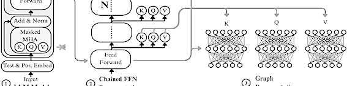
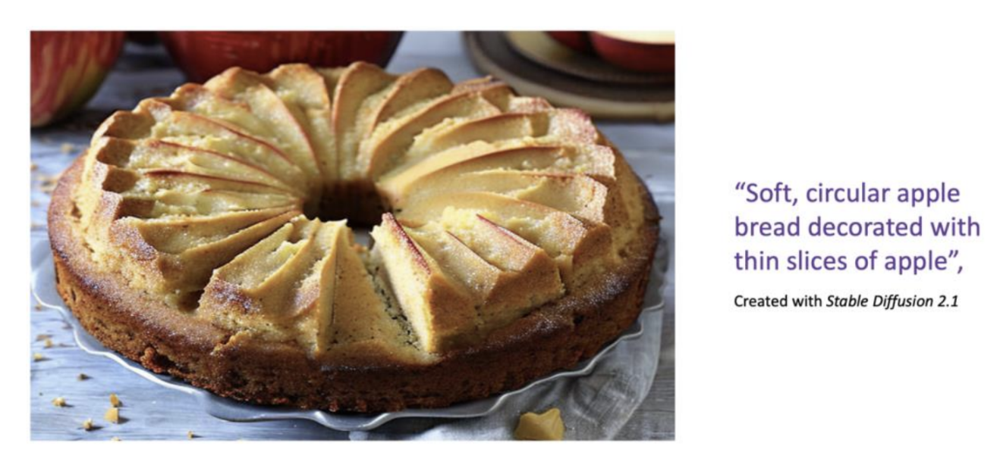
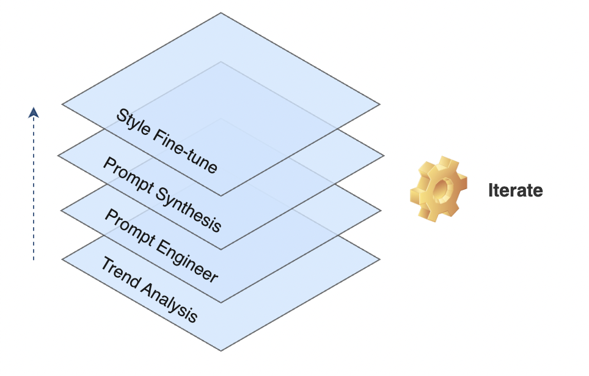
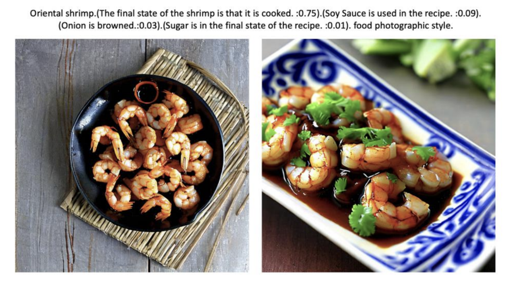
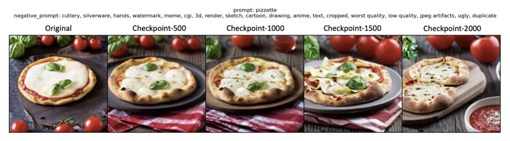

# GenAI for Optimal Recipe Creation at Scale

<p align="left">
  
</p>

> An AI-powered system to optimize product recipes and generate high-quality, on-brand food images. **Objective:** To reduce concept-to-testing time by identifying optimal ingredient combinations and replace traditional food photography with a scalable, automated AI solution for a top CPG brand's global recipe platform.

### Outline

- [Key Results](#key-results)
- [Overview](#overview)
- [Architecture](#architecture)
- [Dataset](#dataset)
- [Modeling](#modeling)
- [Usage](#usage)
- [Structure](#structure)

---

## Key Results

| Metric                      | Result                               | Description |
| :-------------------------- | :----------------------------------- | :----------------------------------- |
| 📈 Consumer Preference Lift | **+20% predicted preference** | Identified novel ingredient combinations with a 20% higher predicted consumer preference score by analyzing market and performance data. |
| 💰 Cost Reduction         | **~$12M/year** potential savings     | Projected annual savings by eliminating the need for traditional photoshoots for the company's vast recipe database. |
| ⚙️ R&D Efficiency   | **From months to days** per concept | Drastically shortened the recipe concept-to-testing cycle by automating trend analysis and ingredient pairing. |
| ✨ Brand Personalization | **High-fidelity style replication** | Successfully mimicked specific market and brand photographic styles using LoRA fine-tuning with as few as 18 source images. |


## Overview

The Recipe Generator is an innovative tool that helps markets and brands enhance their campaign planning, activation, and insights with the help of AI-powered decision-making. The Recipe AI Data Store gathers information from propietary recipes database, Tastewise (trending recipes), and websites/app navigational data to offer insights into the latest and upcoming trending Recipe content. This allows brands and content marketers to provide their consumers with relevant and useful recipe content for an improved experience.

<p align="center">
  
  <br>
  <em>Fig. 1: An AI-generated apple bread photograph.</em>
</p>

The Recipe AI Data Store enhances the recipes database by utilizing both first and third-party data to create recipe trends insights. This enables to rank recipes based on trending data for a specific brand and market, which can be used to inform targeting and creation. For instance, if we look at Oatmeal cookies, the system outputs an overview of trend scores in Tastewise and growth on organic channels. Thereby we can identify whether there is an opportunity in promoting and creating content for Oatmeal cookies in that specific market.

## Architecture

<p align="center">
  
  <br>
  <em>Fig. 2: A simplified diagram of the data analysis, recipe optimization, and generation pipeline.</em>
</p>

## Dataset

The model's input is derived from a combination of external trend data, internal performance data, and a structured recipe database.

| Category | Features | Description |
| :--- | :--- | :--- |
| **External Trend Data** | `Tastewise API data` | Provides insight into emerging consumer interests, popular ingredients, and trending cuisines. Used for recipe optimization. |
| **Internal Performance Data** | `Google Analytics`, `recipe engagement metrics` | Historical data on which recipes have performed well, informing which ingredient combinations are most successful. |
| **Recipe Metadata** | `recipe name`, `recipe description`, `course tags`, `cuisine tags` | High-level contextual information used to frame the dish (e.g., "Main dish", "Asian-style"). |
| **Core Components** | `ingredients list`, `ingredient weights` | A list of all ingredients and their respective quantities. This data is optimized based on trend analysis. |

> The final, **generated text prompt** is the key input for the image model. It's an engineered artifact derived from the **optimized recipe**.

## Modeling

We engineered a multi-stage system, starting with data analysis to inform recipe creation, and then progressively adding layers of sophistication to generate highly specific and stylized images.
- Stage 0: **Trend Analysis & Recipe Optimization**
- Stage 1: **Foundational Prompt Engineering**
- Stage 2: **LLM-Powered Prompt Synthesis**
- Stage 3: **Style Fine-Tuning**

<p align="center">
  
  <br>
  <em>Fig. 3: The layered modeling approach.</em>
</p>

### Stage 0: Trend Analysis & Recipe Optimization
This foundational stage answers the question: *"What should we make in the first place?"* It focuses on using data to generate recipe concepts with a higher probability of success.

| Aspect | Description |
| :--- | :--- |
| **Data Sources** | Ingests data from **Tastewise** and internal **Google Analytics**. |
| **Process** | The system analyzes this data to identify: (1) **Trending Ingredients**: Which ingredients are seeing a surge in consumer interest. (2) **High-Performing Pairs**: Which ingredient combinations have historically led to high engagement. |
| **Output**| A set of **optimized ingredient combinations** that are predicted to have a higher consumer preference. This output serves as the basis for the recipe that will be visualized. |

### Stage 1: Foundational Prompt Engineering

This initial stage established the baseline for image quality. This answers the question: *"How can we ensure a baseline level of photographic quality?"*

| Aspect | Description |
| :--- | :--- |
| **Style Prompts** | Appending phrases like `"food photographic style"`, `"high resolution"`, or `"highly detailed"` to the prompt. |
| **Negative Prompts**| Specifying terms to exclude, such as `"text"`, `"cutlery"`, `"hand"`, or `"blurry"`. |
| **Contextual Tags**| Including metadata tags (e.g., cuisine, occasion) to provide the model with more context. |

### Stage 2: LLM-Powered Prompt Synthesis

This stage addressed the challenge of making the images *faithful* to the specific, optimized recipe. This answers the question: *"How do we make the image accurately represent **our** specific recipe?"*

| Aspect | Description |
| :--- | :--- |
| **Model** | An intelligent pipeline using a Large Language Model (**Gemini 2.5**) to process the optimized recipe data. |
| **Process** | The LLM **synthesizes** the recipe information into a concise and effective prompt by: (1) **Ingredient Weighting**: Prioritizing ingredients with a higher weight. (2) **Final State Analysis**: Analyzing the recipe steps to determine the final appearance of an ingredient (e.g., "mashed," "browned"). |
| **Output**| A structured, weighted prompt that tells the image model not only *what* to include, but how important each element is. |

Below is an **example** of a synthesized prompt.

For a recipe for "Oriental shrimp," the system transformed the raw data into the following detailed prompt, which resulted in a much more accurate image where soy sauce was visible and extraneous ingredients like noodles were removed.

<p align="center">
  
  <br>
  <em>Fig. 2: A comparison between a real photograph and a AI-generated one.</em>
</p>

**Raw Input Data:**
- **Ingredients:** `["Shrimps", "Soy Sauce", "Tomato sauce", "Olive oil", "Onion", ...]`
- **Weights:** `[125.0, 15.0, 11.25, 7.5, 5.0, ...]`
- **Steps:** `["Marinate the shrimp with 2 tablespoons of Soy Sauce", ...]`

**Generated Prompt:**
Oriental shrimp.
(The final state of the shrimp is that it is cooked. :0.75).
(Soy Sauce is used in the recipe. :0.09).
(Onion is browned.:0.03).
(Sugar is in the final state of the recipe. :0.01).
Food photographic style.


### Stage 3: Style Fine-Tuning

This final stage addresses the business need for brand consistency. This answers the question: *"How do we make the image look like it was taken by **our** photographers?"*

| Aspect | Description |
| :--- | :--- |
| **Model** | A fine-tuning technique known as **LoRA** (Low-Rank Adaptation). |
| **Process** | The system was fine-tuned on a small dataset (e.g., 18 images) from a specific brand. At generation time, these learned LoRA weights are applied, influencing the output to match the target style. |
| **Application** | This allows for the creation of different "style models" for each market or brand, which can be easily applied during image generation to ensure a consistent brand aesthetic. |

<p align="center">
  
  <br>
  <em>Fig. 3: Images generated using LoRA fine-tuning on a brand style images.</em>
</p>

## Usage

The system is designed to be integrated into a content management and R&D platform, acting as both a concept generator and a "virtual photographer."

### End-to-End Workflow

1.  **Trend Analysis & Opportunity Identification**: The system continuously analyzes market and internal data to suggest high-potential recipe concepts or ingredient modifications.
2.  **Recipe Selection & Optimization**: A user selects a concept. The system provides the optimized ingredient list.
3.  **Style Selection**: The user selects the target visual style from a library of pre-trained LoRA models.
4.  **Automated Generation**:
    - The system retrieves the optimized recipe's data.
    - The **Prompt Synthesis Engine** (Stage 2) generates the detailed text prompt.
    - The **Image Generation Engine** (Stage 3) uses the prompt and the selected LoRA style to render image variations.
5.  **Review and Use**: The user reviews the options and selects the best one for immediate use, reducing the entire creative process to minutes.

This workflow transforms major operational bottlenecks in both R&D and marketing into a streamlined, data-driven process.

The Recipes Optimizer present opportunities for markets to create competitor advantage and strengthen their marketing efforts across the following areas:
- **Planning Insights**: Use trending data to understand market and cultural shifts in Recipe content
- **Content Creation**: Tailor creatives in Paid and Owned based on trending insight

## Structure

While most of the source code for this project is private, this section outlines a representative structure for this kind of Generative AI project.

```bash
/
├── .gitignore
├── LICENSE
├── README.md
├── requirements.txt
├── config.py
├── assets/                          # (Public) Diagrams and images for documentation.
├── data/
│   ├── recipe_database.csv          # (Private) Example structured recipe data.
│   └── trend_data/                  # (Private) Cache for external API data.
├── models/
│   └── lora_weights/                # (Private) Stores trained LoRA model files.
│       └── style.safetensors
├── notebooks/                       # (Private) Jupyter notebooks for R&D.
│   ├── 01_trend_analysis.ipynb
│   ├── 02_prompt_engineering_tests.ipynb
│   └── 03_lora_fine_tuning.ipynb
└── src/
    ├── __init__.py
    ├── data_ingestion/              # (Private) Scripts for connecting to external/internal data sources.
    │   └── connectors.py
    ├── prompt_synthesis/            # (Private) Scripts for LLM-based prompt generation.
    │   └── generator.py
    └── image_generation/            # (Private) Scripts for image generation and style application.
        └── pipeline.py
```

</br>

> [!WARNING]
> This repository provides a high-level demonstration of the project's architecture and methodology. Certain implementation details and model complexities have been simplified for clarity.

</br>

<p align="center">🌐 © 2025 t.r.</p>
