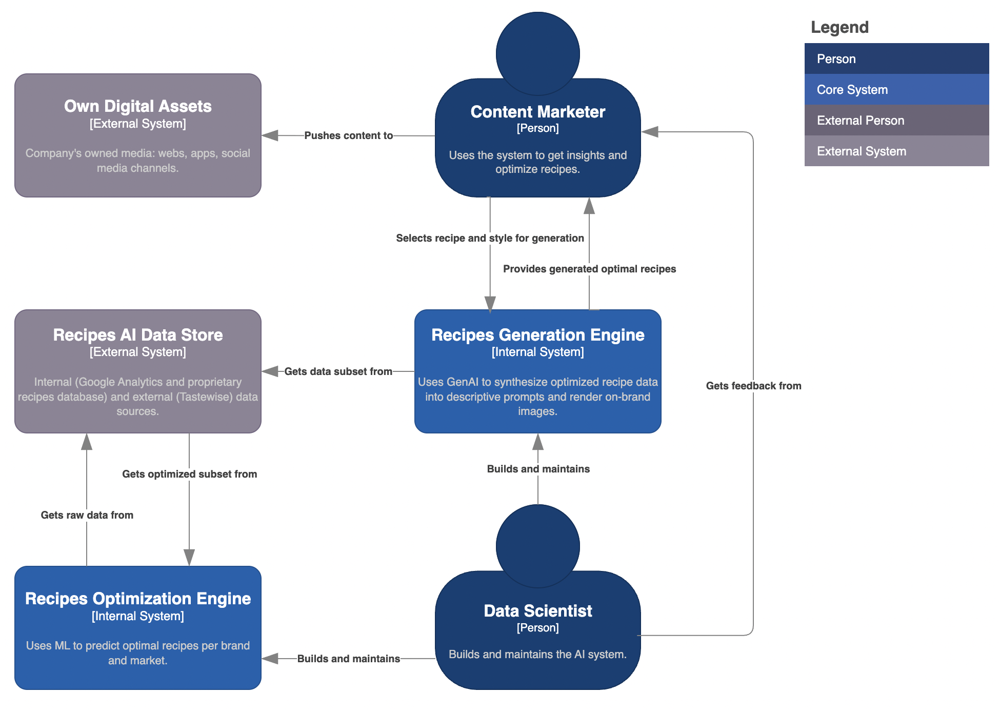

# GenAI for Recipe Optimization and Image Creation

<p align="left">
  
</p>

> An AI-powered system to optimize product recipes and generate high-quality, on-brand food images.
> **Objective:** To reduce concept-to-testing time by identifying optimal ingredient combinations and replace traditional food photography with a scalable, automated AI solution for a top CPG brand's global recipe platform.

### Outline

- [Key Results](#key-results)
- [Overview](#overview)
- [Architecture](#architecture)
- [Dataset](#dataset)
- [Modeling](#modeling)
- [Usage](#usage)
- [Structure](#structure)

---

## Key Results

| Metric                      | Result                               | Description |
| :-------------------------- | :----------------------------------- | :----------------------------------- |
| 📈 Consumer Preference Lift | **+20% predicted preference** | Identified novel ingredient combinations with a 20% higher predicted consumer preference score by analyzing market and performance data. |
| 💰 Cost Reduction         | **~$12M/year** potential savings     | Projected annual savings by eliminating the need for traditional photoshoots for the company's vast recipe database. |
| ⚙️ R&D Efficiency   | **From months to days** per concept | Drastically shortened the recipe concept-to-testing cycle by automating trend analysis and ingredient pairing. |
| ✨ Brand Personalization | **High-fidelity style replication** | Successfully mimicked specific market and brand photographic styles using LoRA fine-tuning with as few as 18 source images. |


## Overview

For any major CPG company, innovating and managing a vast, global database of recipes presents significant challenges. The process is twofold: first, identifying new recipe concepts that will resonate with consumers, and second, creating appealing photography for each recipe, which is traditionally slow and expensive.

This project leverages Generative AI to tackle both challenges. It's a system that not only generates images but first **optimizes the recipes themselves**. By ingesting data from **external sources (Google Trends, Pinterest API)** and **internal sources (Google Analytics)**, the system identifies trending ingredients and successful historical combinations. This data-driven approach informs the creation of optimized recipes, which then feed into an image generation pipeline to produce accurate, on-brand visuals at scale.

<p align="center">
  
  <br>
  <em>Fig. 1: An example of how prompt refinement, informed by recipe data, improves image accuracy and quality.</em>
</p>

The following table maps the primary pain points of the traditional R&D and photography process to the solutions developed in this AI-driven approach:

| 🚩 The Problem | 💡 The Solution |
| :--------------------------- | :---------------------------- |
| **Slow R&D and market insight**: Identifying trending ingredients and successful recipe concepts is a manual, time-consuming process. | **Automated Trend Analysis**: Ingests real-time market data (Google Trends, Pinterest) and internal performance data to identify high-potential ingredient combinations. |
| **High cost & scalability issues**: Professional photoshoots are expensive and difficult to scale across thousands of recipes and markets. | **Cost-effective generation**: Produces images at a fraction of the cost, making it feasible to have a unique image for every single recipe. |
| **Generic or inaccurate visuals**: Stock photos often don't match the actual ingredients or final look of a recipe. | **Intelligent prompt engineering**: Uses LLMs to analyze optimized recipe data to create detailed prompts for accurate visual representation. |
| **Brand inconsistency**: Different markets have unique photographic styles that are hard to maintain globally. | **Style transfer & fine-tuning**: Employs techniques like LoRA to train the model on specific brand styles, ensuring visual consistency and brand alignment. |


## Architecture

The system is designed as a multi-stage pipeline that first analyzes data to optimize a recipe, then translates that recipe into a final, stylized image. It creates a powerful synergy between data analysis, LLMs (for understanding), and Diffusion Models (for visual creation).

<p align="center">
  
  <br>
  <em>Fig. 2: A simplified diagram of the data analysis, recipe optimization, and image generation pipeline.</em>
</p>

### System Synergy
The effectiveness of this system relies on the interplay between its core components:
1. **Data Ingestion & Trend Analysis Engine**: This is the "market analyst." It pulls data from external APIs (Google Trends, Pinterest) and internal analytics to identify trending ingredients and flavor pairings. It provides the foundational insights for recipe optimization.
2.  **Prompt Synthesis Engine (Gemini 2.5):** This engine acts as the "creative director." It ingests the optimized recipe data and transforms it into a rich, descriptive prompt. It intelligently identifies the most visually important ingredients and structures the prompt to guide the image model.
3.  **Image Generation Engine (Stable Diffusion + LoRA):** This engine is the "photographer." It takes the detailed prompt and renders the final image, applying a specific, pre-learned photographic style (e.g., camera angles, lighting) to ensure the output is not just accurate but also on-brand.

## Dataset

The model's input is derived from a combination of external trend data, internal performance data, and a structured recipe database.

| Category | Features | Description |
| :--- | :--- | :--- |
| **External Trend Data** | `Google Trends queries`, `Pinterest API data` | Provides insight into emerging consumer interests, popular ingredients, and trending cuisines. Used for recipe optimization. |
| **Internal Performance Data** | `Google Analytics`, `recipe engagement metrics` | Historical data on which recipes have performed well, informing which ingredient combinations are most successful. |
| **Recipe Metadata** | `recipe name`, `recipe description`, `course tags`, `cuisine tags` | High-level contextual information used to frame the dish (e.g., "Main dish", "Asian-style"). |
| **Core Components** | `ingredients list`, `ingredient weights` | A list of all ingredients and their respective quantities. This data is optimized based on trend analysis. |

> The final, **generated text prompt** is the key input for the image model. It's an engineered artifact derived from the **optimized recipe**.

## Modeling

We engineered a multi-stage system, starting with data analysis to inform recipe creation, and then progressively adding layers of sophistication to generate highly specific and stylized images.
- Stage 0: **Trend Analysis & Recipe Optimization**
- Stage 1: **Foundational Prompt Engineering**
- Stage 2: **LLM-Powered Prompt Synthesis**
- Stage 3: **Style-Aware Fine-Tuning**

<p align="left">
  
  <br>
  <em>Fig. 3: The layered modeling approach.</em>
</p>

### Stage 0: Trend Analysis & Recipe Optimization
This foundational stage answers the question: *"What should we make in the first place?"* It focuses on using data to generate recipe concepts with a higher probability of success.

| Aspect | Description |
| :--- | :--- |
| **Data Sources** | Ingests data from **Google Trends**, **Pinterest API**, and internal **Google Analytics**. |
| **Process** | The system analyzes this data to identify: 1. **Trending Ingredients**: Which ingredients are seeing a surge in consumer interest. 2. **High-Performing Pairs**: Which ingredient combinations have historically led to high engagement. |
| **Output**| A set of **optimized ingredient combinations** that are predicted to have a higher consumer preference. This output serves as the basis for the recipe that will be visualized. |

### Stage 1: Foundational Prompt Engineering

This initial stage established the baseline for image quality. This answers the question: *"How can we ensure a baseline level of photographic quality?"*

| Aspect | Description |
| :--- | :--- |
| **Style Prompts** | Appending phrases like `"food photographic style"`, `"high resolution"`, or `"highly detailed"` to the prompt. |
| **Negative Prompts**| Specifying terms to exclude, such as `"text"`, `"cutlery"`, `"hand"`, or `"blurry"`. |
| **Contextual Tags**| Including metadata tags (e.g., cuisine, occasion) to provide the model with more context. |

### Stage 2: LLM-Powered Prompt Synthesis

This stage addressed the challenge of making the images *faithful* to the specific, optimized recipe. This answers the question: *"How do we make the image accurately represent **our** specific recipe?"*

| Aspect | Description |
| :--- | :--- |
| **Model** | An intelligent pipeline using a Large Language Model (**Gemini 2.5**) to process the optimized recipe data. |
| **Process** | The LLM **synthesizes** the recipe information into a concise and effective prompt by: 1. **Ingredient Weighting**: Prioritizing ingredients with a higher weight. 2. **Final State Analysis**: Analyzing the recipe steps to determine the final appearance of an ingredient (e.g., "mashed," "browned"). |
| **Output**| A structured, weighted prompt that tells the image model not only *what* to include, but how important each element is. |

<details>
<summary><b>Click to see an example of a synthesized prompt</b></summary>
</br>

For a recipe for "Oriental shrimp," the system transformed the raw data into the following detailed prompt, which resulted in a much more accurate image where soy sauce was visible and extraneous ingredients like noodles were removed.

**Raw Input Data:**
- **Ingredients:** `["Shrimps", "MAGGI Soy Sauce", "Tomato sauce", "Olive oil", "Onion", ...]`
- **Weights:** `[125.0, 15.0, 11.25, 7.5, 5.0, ...]`
- **Steps:** `["Marinate the shrimp with 2 tablespoons of MAGGI Soy Sauce", ...]`

**Generated Prompt:**
Oriental shrimp.
(The final state of the shrimp is that it is cooked. :0.75).
(Soy Sauce is used in the recipe. :0.09).
(Onion is browned.:0.03).
(Sugar is in the final state of the recipe. :0.01).
Food photographic style.

</details>

### Stage 3: Style-Aware Fine-Tuning

This final stage addresses the business need for brand consistency. This answers the question: *"How do we make the image look like it was taken by **our** photographers?"*

| Aspect | Description |
| :--- | :--- |
| **Model** | A fine-tuning technique known as **LoRA** (Low-Rank Adaptation). |
| **Process** | The system was fine-tuned on a small dataset (e.g., 18 images) from a specific brand. At generation time, these learned LoRA weights are applied, influencing the output to match the target style. |
| **Application** | This allows for the creation of different "style models" for each market or brand, which can be easily applied during image generation to ensure a consistent brand aesthetic. |

## Usage

The system is designed to be integrated into a content management and R&D platform, acting as both a concept generator and a "virtual photographer."

### End-to-End Workflow

1.  **Trend Analysis & Opportunity Identification**: The system continuously analyzes market and internal data to suggest high-potential recipe concepts or ingredient modifications.
2.  **Recipe Selection & Optimization**: A user selects a concept. The system provides the optimized ingredient list.
3.  **Style Selection**: The user selects the target visual style from a library of pre-trained LoRA models (e.g., "Winiary - Poland Style," "Buitoni - Italy Style").
4.  **Automated Generation**:
    * The system retrieves the optimized recipe's data.
    * The **Prompt Synthesis Engine** (Stage 2) generates the detailed text prompt.
    * The **Image Generation Engine** (Stage 3) uses the prompt and the selected LoRA style to render image variations.
5.  **Review and Use**: The user reviews the options and selects the best one for immediate use, reducing the entire creative process to minutes.

This workflow transforms major operational bottlenecks in both R&D and marketing into a streamlined, data-driven process.


## Structure

While most of the source code for this project is private, this section outlines a representative structure for this kind of Generative AI project.

```bash
/
├── .gitignore
├── LICENSE
├── README.md
├── requirements.txt
├── config.py
├── assets/                          # (Public) Diagrams and images for documentation.
├── data/
│   ├── recipe_database.csv          # (Private) Example structured recipe data.
│   └── trend_data/                  # (Private) Cache for external API data.
├── models/
│   └── lora_weights/                 # (Private) Stores trained LoRA model files.
│       ├── buitoni_style.safetensors
│       └── winiary_style.safetensors
├── notebooks/                       # (Private) Jupyter notebooks for R&D.
│   ├── 01_trend_analysis.ipynb
│   ├── 02_prompt_engineering_tests.ipynb
│   └── 03_lora_fine_tuning.ipynb
└── src/
    ├── __init__.py
    ├── data_ingestion/              # (Private) Scripts for connecting to external/internal data sources.
    │   └── connectors.py
    ├── prompt_synthesis/            # (Private) Scripts for LLM-based prompt generation.
    │   └── generator.py
    └── image_generation/            # (Private) Scripts for image generation and style application.
        └── pipeline.py
```

</br>

> [!WARNING]
This repository provides a high-level demonstration of the project's architecture and methodology. Certain implementation details and model complexities have been simplified for clarity.

</br>

<p align="center">🌐 © 2025 t.r.</p>
